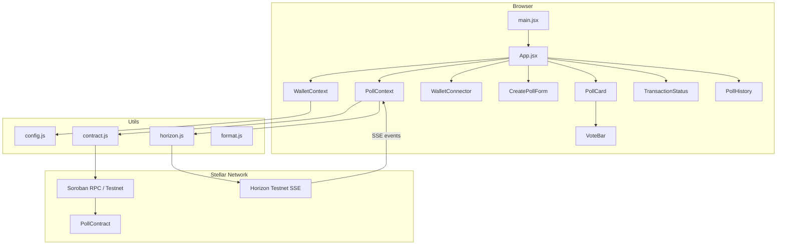
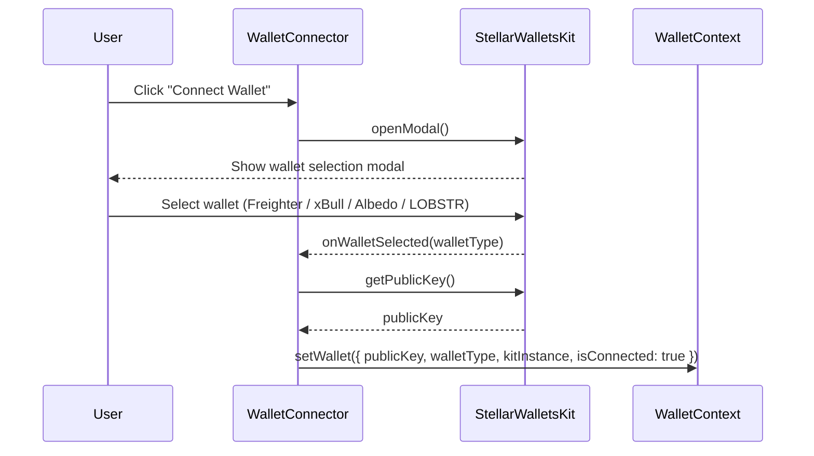
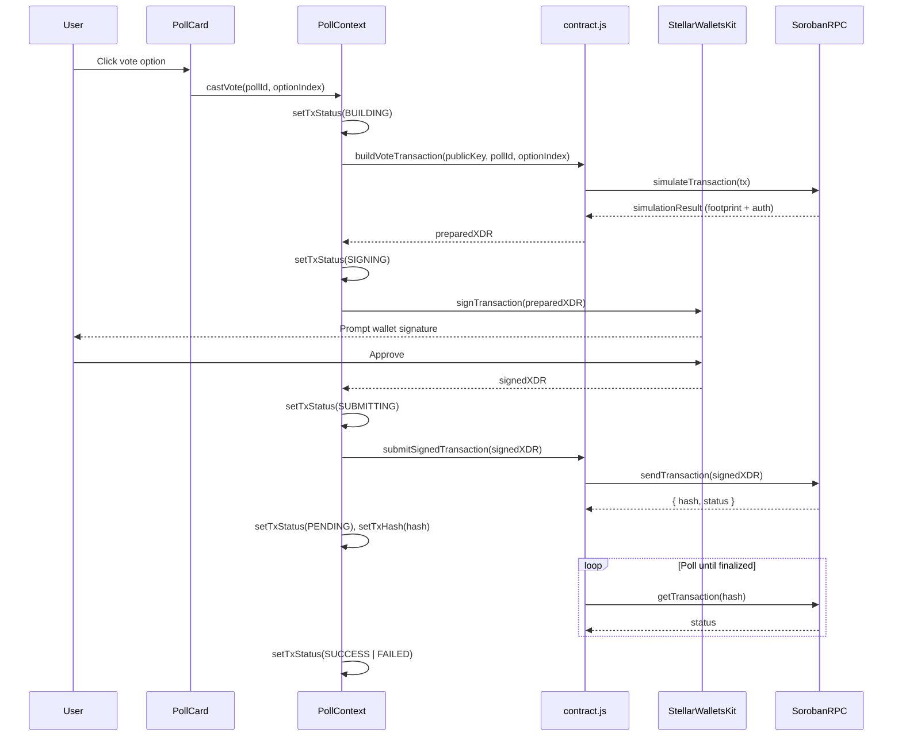
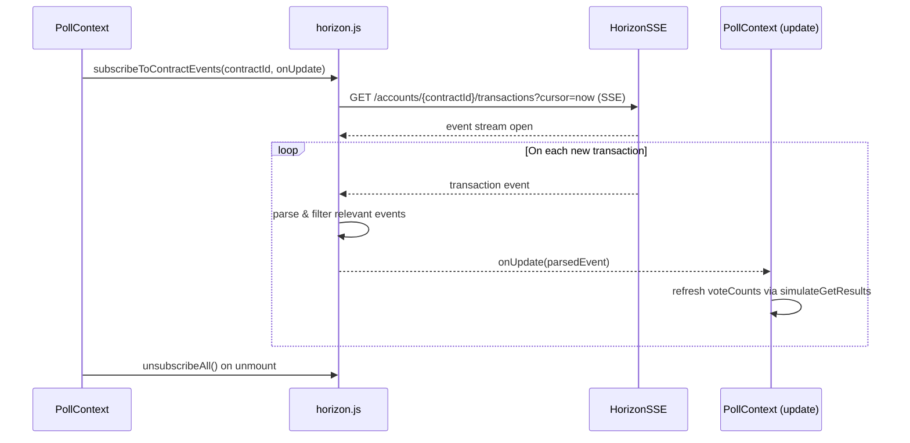

# Design Document: Stellar Live Poll dApp

## Overview

The Stellar Live Poll dApp is a decentralized polling application built on the Stellar testnet that allows users to create polls, cast votes via Soroban smart contracts, and watch results update in real time through Horizon Server-Sent Events (SSE). It is a Level 2 Stellar project demonstrating multi-wallet integration, Soroban contract interaction, and live blockchain event streaming in a React 18 + Vite frontend.

The application follows a strict separation of concerns: all Soroban contract calls are isolated in `src/utils/contract.js`, all Horizon SSE logic lives in `src/utils/horizon.js`, environment configuration is centralized in `src/utils/config.js`, and UI state is managed through two React contexts (`WalletContext`, `PollContext`). No class components are used anywhere in the codebase.

The full transaction lifecycle — from building an XDR transaction to signing it in the user's wallet and submitting it to the network — is tracked through a finite state machine with states: `IDLE → BUILDING → SIGNING → SUBMITTING → PENDING → SUCCESS | FAILED`.

---

## Architecture



---

## Sequence Diagrams

### Connect Wallet Flow



### Cast Vote Transaction Flow



### Real-time Update Flow



---

## Components and Interfaces

### WalletConnector (`src/components/WalletConnector.jsx`)

**Purpose**: Renders the connect/disconnect button and delegates wallet lifecycle to `WalletContext`.

**Interface**:
```typescript
// Props: none
// Consumes: useWallet() hook from WalletContext
// Renders: <button> connect | disconnect + connected address display
```

**Responsibilities**:
- Open StellarWalletsKit modal on connect click
- Display truncated public key when connected
- Trigger disconnect and state reset on disconnect click

---

### PollCard (`src/components/PollCard.jsx`)

**Purpose**: Displays a single poll's question, options, vote bars, and voting controls.

**Interface**:
```typescript
interface PollCardProps {
  pollId: number
  question: string
  options: string[]
  voteCounts: number[]
  hasVoted: boolean
  isClosed: boolean
  isLoading: boolean
  onVote: (optionIndex: number) => void
  onClose: () => void
}
```

**Responsibilities**:
- Render each option with a `VoteBar`
- Disable voting if `hasVoted` or `isClosed`
- Show close poll button only to poll creator

---

### VoteBar (`src/components/VoteBar.jsx`)

**Purpose**: Visual percentage bar for a single vote option.

**Interface**:
```typescript
interface VoteBarProps {
  label: string
  votes: number
  totalVotes: number
  isWinner: boolean
}
```

**Responsibilities**:
- Compute percentage from `votes / totalVotes`
- Animate bar width via CSS transition
- Highlight winning option

---

### CreatePollForm (`src/components/CreatePollForm.jsx`)

**Purpose**: Form for creating a new poll with a question and 2–4 options.

**Interface**:
```typescript
// Props: none
// Consumes: useWallet(), usePoll()
// Internal state: question (string), options (string[])
```

**Responsibilities**:
- Validate: question non-empty, 2–4 non-empty options
- Call `PollContext.createPoll(question, options)` on submit
- Disable submit while `isLoading`

---

### TransactionStatus (`src/components/TransactionStatus.jsx`)

**Purpose**: Displays current transaction state machine status to the user.

**Interface**:
```typescript
// Props: none
// Consumes: usePoll() → { txStatus, txHash, txError }
```

**Responsibilities**:
- Map `txStatus` enum to human-readable message and icon
- Show Stellar Expert link when `txHash` is available
- Auto-dismiss on SUCCESS after 5 seconds

---

### PollHistory (`src/components/PollHistory.jsx`)

**Purpose**: Fetches and displays a feed of past poll transactions from Horizon.

**Interface**:
```typescript
// Props: none
// Consumes: config.js VITE_CONTRACT_ID, VITE_HORIZON_URL
```

**Responsibilities**:
- Fetch `/accounts/{contractId}/transactions?order=desc&limit=20` on mount
- Parse and display poll creation / vote events
- Show loading skeleton while fetching

---

## Data Models

### WalletState

```typescript
interface WalletState {
  publicKey: string | null       // Stellar G... address
  walletType: string | null      // 'FREIGHTER' | 'XBULL' | 'ALBEDO' | 'LOBSTR'
  kitInstance: StellarWalletsKit | null
  isConnected: boolean
}
```

**Validation Rules**:
- `publicKey` must be a valid Stellar public key (56-char G... string) when set
- `isConnected` is `true` if and only if `publicKey` is non-null

---

### PollState

```typescript
interface PollState {
  activePoll: Poll | null
  voteCounts: number[]
  hasVoted: boolean
  isLoading: boolean
  isClosed: boolean
  txStatus: TxStatus
  txHash: string | null
  txError: string | null
}

interface Poll {
  id: number
  question: string
  options: string[]
  creator: string   // Stellar public key
}

type TxStatus = 'IDLE' | 'BUILDING' | 'SIGNING' | 'SUBMITTING' | 'PENDING' | 'SUCCESS' | 'FAILED'
```

---

### Config

```typescript
interface Config {
  CONTRACT_ID: string
  HORIZON_URL: string
  NETWORK_PASSPHRASE: string
  RPC_URL: string
}
```

**Validation Rules**:
- `CONTRACT_ID` must be non-empty; if missing, UI shows setup warning
- `HORIZON_URL` defaults to `https://horizon-testnet.stellar.org`
- `NETWORK_PASSPHRASE` defaults to `Test SDF Network ; September 2015`

---

## Algorithmic Pseudocode

### Transaction State Machine

```pascal
ALGORITHM manageTxLifecycle(action, params)
INPUT: action ∈ {CAST_VOTE, CREATE_POLL, CLOSE_POLL}, params
OUTPUT: final txStatus ∈ {SUCCESS, FAILED}

BEGIN
  setTxStatus(BUILDING)
  
  TRY
    xdr ← buildTransaction(action, params)
    
    setTxStatus(SIGNING)
    signedXDR ← walletKit.signTransaction(xdr, networkPassphrase)
    
    setTxStatus(SUBMITTING)
    { hash, status } ← submitSignedTransaction(signedXDR)
    
    setTxStatus(PENDING)
    setTxHash(hash)
    
    REPEAT
      result ← sorobanRPC.getTransaction(hash)
      WAIT 2000ms
    UNTIL result.status ≠ PENDING
    
    IF result.status = SUCCESS THEN
      setTxStatus(SUCCESS)
      refreshPollData()
    ELSE
      setTxStatus(FAILED)
      setTxError(result.resultXdr)
    END IF
    
  CATCH error
    setTxStatus(FAILED)
    setTxError(error.message)
  END TRY
END
```

**Preconditions**:
- `publicKey` is non-null (wallet connected)
- `CONTRACT_ID` is configured
- `action` is a valid contract function name

**Postconditions**:
- `txStatus` is always either `SUCCESS` or `FAILED` after completion
- On `SUCCESS`, `voteCounts` are refreshed via `simulateGetResults`
- On `FAILED`, `txError` contains a human-readable message

**Loop Invariants**:
- `hash` remains constant throughout polling loop
- Each iteration waits 2 seconds before re-querying

---

### SSE Subscription Management

```pascal
ALGORITHM subscribeToContractEvents(contractId, onUpdate)
INPUT: contractId (string), onUpdate (callback)
OUTPUT: EventSource handle

BEGIN
  url ← buildSSEUrl(contractId, cursor="now")
  source ← new EventSource(url)
  
  source.onmessage ← PROCEDURE(event)
    tx ← JSON.parse(event.data)
    IF isRelevantContractTx(tx, contractId) THEN
      parsed ← parseContractEvent(tx)
      onUpdate(parsed)
    END IF
  END PROCEDURE
  
  source.onerror ← PROCEDURE(err)
    LOG "SSE error, reconnecting..."
    source.close()
    WAIT 3000ms
    subscribeToContractEvents(contractId, onUpdate)
  END PROCEDURE
  
  STORE source IN activeSubscriptions[contractId]
  RETURN source
END

ALGORITHM unsubscribeAll()
BEGIN
  FOR each source IN activeSubscriptions DO
    source.close()
  END FOR
  CLEAR activeSubscriptions
END
```

**Preconditions**:
- `contractId` is a valid Stellar contract address
- `HORIZON_URL` is reachable

**Postconditions**:
- `onUpdate` is called for every new relevant transaction
- `unsubscribeAll` closes all open EventSource connections with no leaks

---

### Config Validation

```pascal
ALGORITHM loadConfig()
OUTPUT: Config | SetupWarning

BEGIN
  contractId ← import.meta.env.VITE_CONTRACT_ID
  horizonUrl ← import.meta.env.VITE_HORIZON_URL ?? "https://horizon-testnet.stellar.org"
  passphrase ← import.meta.env.VITE_NETWORK_PASSPHRASE ?? "Test SDF Network ; September 2015"
  
  IF contractId IS NULL OR contractId = "" THEN
    EMIT setupWarning("VITE_CONTRACT_ID is not set. Please configure your .env file.")
  END IF
  
  RETURN { CONTRACT_ID: contractId, HORIZON_URL: horizonUrl, NETWORK_PASSPHRASE: passphrase }
END
```

---

## Key Functions with Formal Specifications

### `buildVoteTransaction(publicKey, pollId, optionIndex)`

```typescript
function buildVoteTransaction(
  publicKey: string,
  pollId: number,
  optionIndex: number
): Promise<string>  // returns base64 XDR
```

**Preconditions**:
- `publicKey` is a valid Stellar G... address (56 chars)
- `pollId` is a non-negative integer
- `optionIndex` is a non-negative integer within bounds of poll options

**Postconditions**:
- Returns a valid base64-encoded XDR transaction string
- Transaction includes Soroban auth entries from simulation
- Transaction is ready for wallet signing (no further assembly needed)

---

### `simulateGetResults(pollId)`

```typescript
function simulateGetResults(pollId: number): Promise<number[]>
```

**Preconditions**:
- `pollId` is a non-negative integer referencing an existing poll

**Postconditions**:
- Returns array of vote counts, one per option
- Array length equals number of options in the poll
- No on-chain state is mutated (read-only simulation)

---

### `simulateHasVoted(pollId, address)`

```typescript
function simulateHasVoted(pollId: number, address: string): Promise<boolean>
```

**Preconditions**:
- `pollId` is valid
- `address` is a valid Stellar public key

**Postconditions**:
- Returns `true` if and only if `address` has cast a vote on `pollId`
- No on-chain state is mutated

---

### `submitSignedTransaction(signedXDR)`

```typescript
function submitSignedTransaction(signedXDR: string): Promise<{ hash: string, status: string }>
```

**Preconditions**:
- `signedXDR` is a valid base64-encoded signed Soroban transaction

**Postconditions**:
- Returns `{ hash, status }` where `hash` is the transaction hash
- Throws on network error or immediate rejection
- Does not poll for finality (caller is responsible for polling)

---

## Correctness Properties

```pascal
// P1: Wallet invariant
∀ state ∈ WalletState:
  state.isConnected = true ⟺ state.publicKey ≠ null

// P2: Vote immutability
∀ poll, address:
  simulateHasVoted(poll.id, address) = true ⟹
    castVote(poll.id, _, address) returns Error

// P3: Transaction state machine is acyclic
∀ tx:
  txStatus transitions only forward:
  IDLE → BUILDING → SIGNING → SUBMITTING → PENDING → (SUCCESS | FAILED)
  No backward transitions are possible

// P4: SSE subscription cleanup
∀ subscription:
  unsubscribeAll() called ⟹ no further onUpdate callbacks fire

// P5: Config warning
CONTRACT_ID = "" ∨ CONTRACT_ID = null ⟹ UI renders setup warning

// P6: Vote count consistency
∀ poll after SUCCESS transaction:
  sum(simulateGetResults(poll.id)) = previous_sum + 1

// P7: Poll closure
∀ poll where isClosed = true:
  castVote(poll.id, _, _) returns Error
  PollCard renders all vote buttons as disabled
```

---

## Error Handling

### Missing Contract ID

**Condition**: `VITE_CONTRACT_ID` is empty or undefined at startup  
**Response**: `config.js` exports `CONTRACT_ID` as empty string; `App.jsx` renders a `<SetupWarning>` banner  
**Recovery**: User adds the env var and restarts dev server

### Wallet Not Connected

**Condition**: User attempts to vote or create poll without connecting wallet  
**Response**: Button is disabled; tooltip reads "Connect wallet to vote"  
**Recovery**: User connects wallet via `WalletConnector`

### Transaction Simulation Failure

**Condition**: Soroban RPC returns error during `simulateTransaction`  
**Response**: `txStatus` → `FAILED`, `txError` set to RPC error message  
**Recovery**: User can retry; `TransactionStatus` shows error with dismiss button

### SSE Connection Drop

**Condition**: `EventSource` fires `onerror`  
**Response**: `horizon.js` closes the source, waits 3 seconds, re-subscribes  
**Recovery**: Automatic reconnect; no user action required

### Double Vote Attempt

**Condition**: `has_voted` returns `true` for current user on active poll  
**Response**: Vote buttons disabled; `hasVoted` flag set in `PollContext`  
**Recovery**: N/A — by design, one vote per address per poll

---

## Testing Strategy

### Unit Testing Approach

Test each utility function in isolation with mocked Soroban RPC and Horizon responses:
- `config.js`: verify warning emitted when `CONTRACT_ID` missing
- `contract.js`: mock `SorobanRpc.Server`, verify XDR construction and result parsing
- `format.js`: pure function tests for address truncation, percentage calculation
- `horizon.js`: mock `EventSource`, verify subscription/unsubscription lifecycle

### Property-Based Testing Approach

**Property Test Library**: `fast-check`

Key properties to test:
- `formatAddress(key)` always returns a string of length ≤ 56 for any valid key
- `calculatePercentage(votes, total)` always returns value in `[0, 100]` for non-negative inputs
- Transaction state machine never transitions backward for any sequence of valid actions
- `unsubscribeAll()` after N subscriptions always results in 0 active EventSources

### Integration Testing Approach

- Use Stellar testnet with a deployed `PollContract` for end-to-end smoke tests
- Mock wallet signing in CI using a test keypair
- Verify full vote flow: `buildVoteTransaction` → sign → `submitSignedTransaction` → poll finality

---

## Performance Considerations

- SSE connections are singleton per `contractId` — no duplicate subscriptions
- `simulateGetResults` is called only on SSE event or after successful transaction, not on a timer
- `PollHistory` fetches at most 20 transactions on mount; no infinite scroll in v1
- Vite's `globalThis` + `buffer` alias ensures Stellar SDK polyfills load once at bundle time

---

## Security Considerations

- Private keys never touch the frontend — all signing is delegated to the wallet extension/app
- `CONTRACT_ID` is a public address; no secrets in `.env` for this project
- XDR transactions are simulated before signing to prevent blind signing
- No user input is passed directly to contract calls without validation (question length, option count bounds)

---

## Dependencies

| Package | Purpose |
|---|---|
| `react` / `react-dom` 18 | UI framework |
| `vite` | Build tool and dev server |
| `@stellar/stellar-wallets-kit` | Multi-wallet modal (Freighter, xBull, Albedo, LOBSTR) |
| `@stellar/stellar-sdk` | Stellar transaction building, keypair, XDR |
| `soroban-client` | Soroban RPC simulation and submission |

No additional libraries beyond the spec are used.
